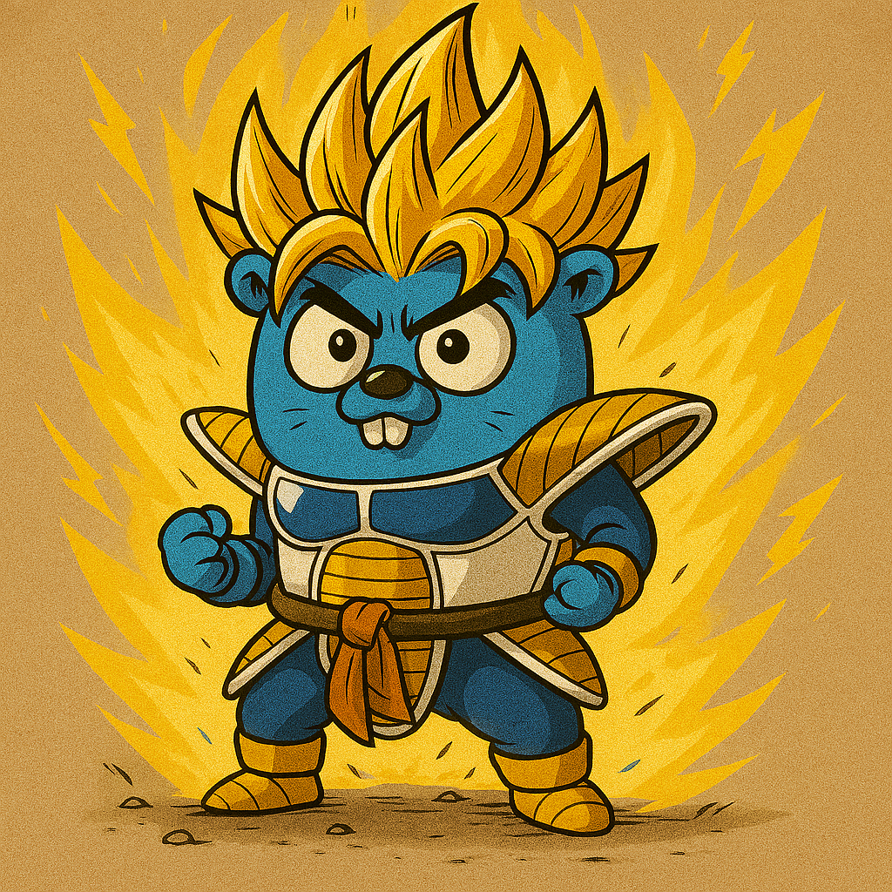

# goku



Golang code generation CLI. Goku helps make go code faster

## Interface generation

Create interfaces fast from structs. With source code like this:

```go
package abc
import "some/importThing"
type Target struct {}
func (t *Target) Method(x int, y importThing.Field) error { return nil}
```

Run `goku iface Target`. This generates to stdout:

```go
package abc
import "some/importThing" // picks up imports
type TargetInterface interface { // you can change this name
    Method(x int, y importThing.Field) error
}
```

You can add private methods, generate mocks, change the search dir;
all options:

```
	-h, --help				Display help text for this command
	-d, --dir STRING		Scan this dir for the struct
	-m, --mock STRING		Generate a mock implementation also
	-n, --name STRING		Override the interface name with this name
						    (defaults to STRUCTNAME+"Interface")
	-p, --pkg STRING		Override the package name. By default, it uses
						    the package of the struct
	--private				Include private methods
	-o, --out				Don't generate to stdout
```